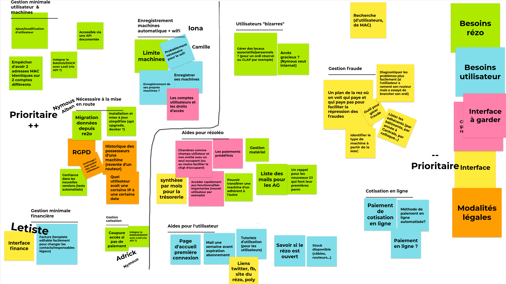

# README

## Requirements

- Ruby version 2.7.1 (see [.ruby-version](.ruby-version))
- Node v12.18.4 (see [.nvmrc](.nvmrc))
- PostgreSQL 12.4+

It is recommended to use [rbenv][rbenv] and [nvm][nvm] to install both language runtimes.

[rbenv]: https://github.com/rbenv/rbenv
[nvm]: https://github.com/nvm-sh/nvm

## Development

1. Install NodeJS and Ruby in the correct versions (run `rbenv version` and `nvm use` to check)
2. Install PostgreSQL
3. Clone the project
4. Install dependencies:
   1. `bundle install`
   2. `npm install`
5. Initialize the database (users, databases) by running [`init_db.sql`](.github/workflows/init_db.sql): `sudo --user postgres psql < ./.github/workflows/init_db.sql`
6. (Optional) Edit [`config/database.yml`](config/database.yml) if you chose a different password

## Documentation

See the [docs](docs/) folder for the documentation.

For now only an [image summing up our requirements](docs/Lea5-Definition-des-besoins.png) is available.

This README would normally document whatever steps are necessary to get the
application up and running.

Things you may want to cover:

* Ruby version

* System dependencies

* Configuration

* Database creation

* Database initialization

* How to run the test suite

* Services (job queues, cache servers, search engines, etc.)

* Deployment instructions

* ...

## Inspirations

- Our original project [Lea4][lea4]. We had to move to Re2o when we became independant and needed to manage subscriptions.
- [Re2o][re2o], which we used for 4 years. Unfortunately it does too much, and is too complex to configure, use and maintain.

[lea4]: https://github.com/rezoleo/le4/
[re2o]: https://gitlab.federez.net/re2o/re2o

## License

[MIT](./LICENSE)
