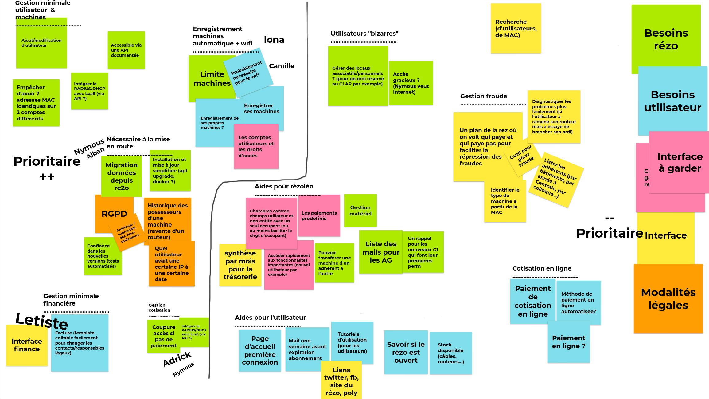
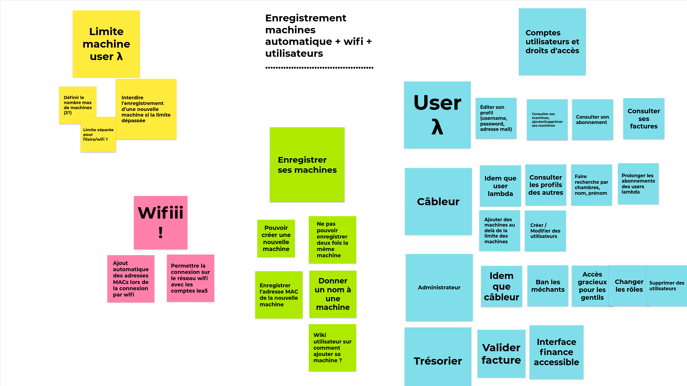

# Requirements

## Requirements overview

## Detailed requirements

Priority order:
1. Users
2. Machines
3. Subscriptions
4. Machines history
5. Migrate data from Re2o
6. Finance
7. User rights
8. Free subscription/Ban
9. Wifi

