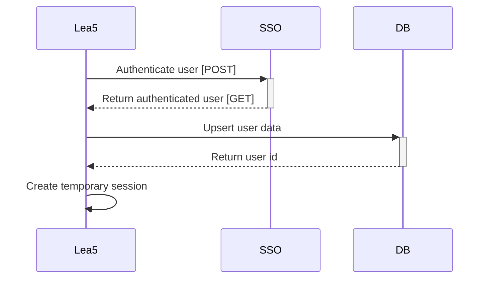

# Authentication

The authentication is done via a SSO system.

The general flow for the authentication is described below:

You can read the [Auth0 docs on the Authorization Code flow](https://auth0.com/docs/get-started/authentication-and-authorization-flow/authorization-code-flow)
if you want more details.

Configuration for the SSO can be found in [`config/initializers/omniauth.rb`](../../config/initializers/omniauth.rb).
