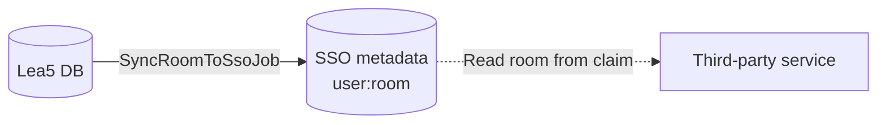

# Rooms

Lea5 is the source of truth for room ownership, defined by the ownership of the ethernet socket in each room.

The authoritative ownership is stored in Lea5 (`rooms.user_id`) and mirrored to the SSO as metadata (`key: room`) so that other systems can consume it.

The SSO metadata value represents the validated room assigned to a user, as determined by Lea5. Authorized third-party services may read this claim and use it as a default, or store their own room value (e.g., user-provided input) independently. Such external values do not affect Lea5.

## Room list

The room seeding is hardcoded in `db/seeds/rooms.rb` as it is hardly ever expected to change (because they are physical rooms). Listing all rooms allows to have full visibility and control over the existing rooms, if they are single or double, and any special cases instead of relying on regex patterns.

## Relationship model

Ownership is intentionally modeled from room to user (`rooms.user_id`) to naturally represent who (if anyone) occupies a given room.
This design also allows for future flexibility, such as assigning multiple rooms to a single entity (e.g., a club or organization account).

