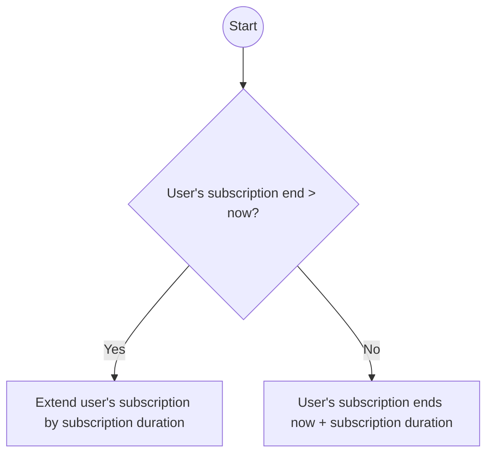

# Subscription

## Add a new subscription to a user
The new user's subscription expiration is determined as follow:

> **Warning**
> If a user has a free access when a subscription is added, the starting date
> of the subscription is based on the subscription expiration status, *not* the internet
> expiration status.
