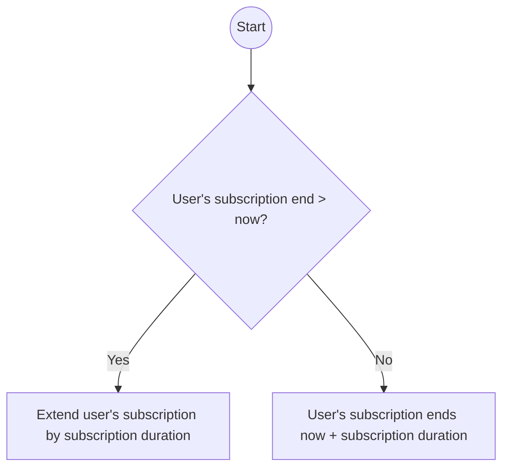

# Subscription

## Add a new subscription to a user
The new user's subscription expiration is determined as follow:

```mermaid
graph TD
    A((Start)) --> B{User's subscription end > now?}
    B --> |Yes| C[Extend user's subscription by subscription duration]
    B --> |No| D[User's subscription ends now + subscription duration]
```

**Warning**
If a user has a free access when a subscription is added, the starting date
of the subscription is based on the subscription expiration status, *not* the internet
expiration status.

## Refunding subscriptions

When a subscription is refunded, the system calculates a credit-note amount
based on what was paid minus the cost of consumed months.

There is a 1-week grace period from the start date of each month. Within this
grace period, the month is not considered as consumed, allowing users to
get a full refund within one week of a started month.

The refund amount is calculated as follows:

```
Refund = Amount paid - Cost of consumed months (floored at zero)
```

where the cost of consumed months is determined using `SubscriptionPricing.cost_for()`,
which uses a greedy algorithm based on available offers at the time of subscription purchase.
